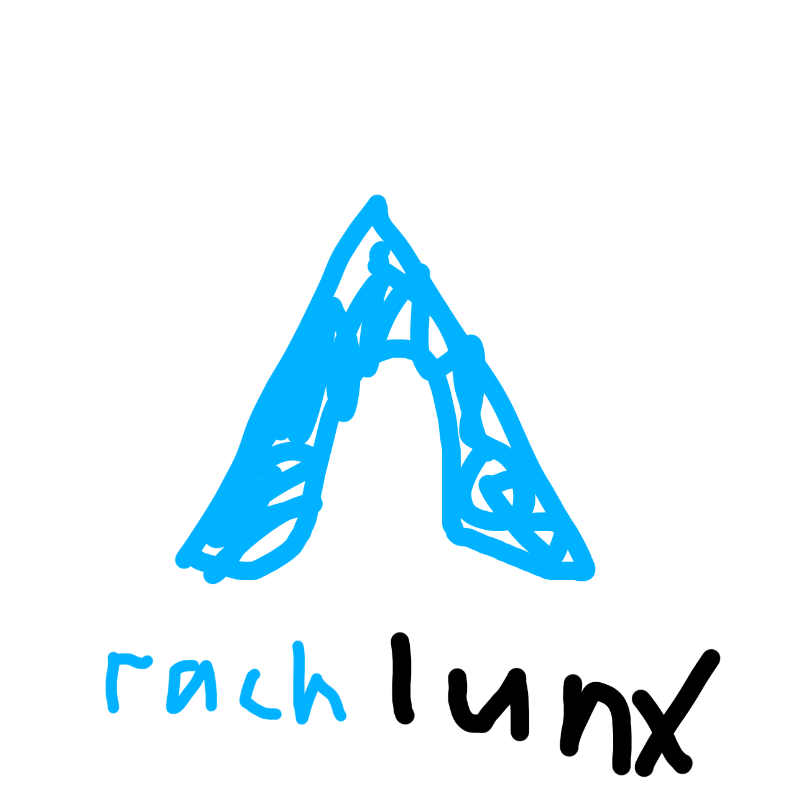

  

# rach lunx

The most Arch Linux installer

## Disclaimer

please don't be mad at me if this script deletes something important

## Usage

0. Choose a [custom script](./custom) (optional)
1. Boot into the Arch installer image
2. `mkcd /tmp/rach`
3. `curl overli.st/rach | tar -xz && ./rach.sh base <disk>`
4. [Configure the timezone, locales and the hostname](https://wiki.archlinux.org/title/Installation_guide#Time_zone)
5. Ctrl + D
6. Log in as `root`
7. `/usr/share/rach/rach.sh userspace <username> [custom script]`

## Design

The whole installer is built in a way that allows for very easy debugging. By
simply sourcing the `tasks.sh` file, you get immediate access to all the
individual steps of the installation process.

All tasks are prefixes with one of the following environments:

- `iso`: Shell that you get in the installer ISO image
- `chroot`: Chroot shell inside of the half-baked system root
- `root`: Root shell in the booted system
- `user`: User shell in the booted system

## Custom

Feel free to send me pull requests with your own `custom/` scripts
